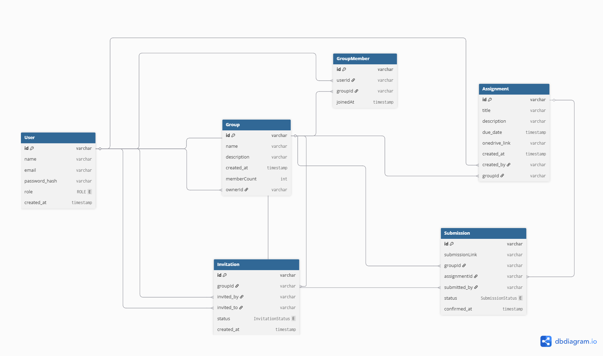
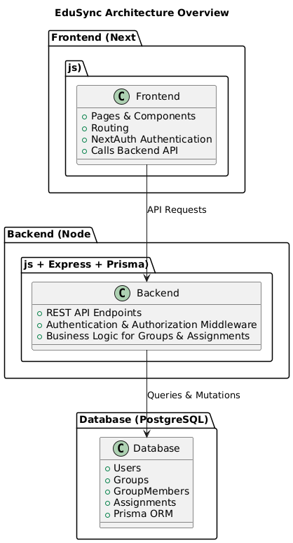

# EduSync

## 📖 Overview
EduSync is a **Student, Group & Assignment Management System** built with **Next.js** (frontend) and **Node.js + Express + Prisma + PostgreSQL** (backend).  
It allows:
- Admins to manage students, groups, and assignments.  
- Students to view groups and their assignments.  
- Secure authentication with role-based access control.

---

## ⚙️ Setup & Run Instructions

### Prerequisites
- Node.js >= 20  
- Docker & Docker Compose (for containerized setup)  
- PostgreSQL (or use Dockerized DB)  

### Local Setup

#### 1. Clone the repository
```bash
git clone www.github.com/SarthDhakade963/edusync

cd EduSync
```

####2. Setup Backend
```bash
cd server
npm install
cp .env.example .env    # set DB credentials
npx prisma migrate dev  # apply migrations
npm run dev             # start backend server (http://localhost:5000)
```

3. Setup Frontend
```bash
cd ../client
npm install
npm run dev             # start frontend (http://localhost:3000)
```

4. Dockerized Setup
```bash
docker-compose up --build
```
Backend: http://localhost:5000

Frontend: http://localhost:3000

## 🛠 API Endpoints

### Auth
| Method | Endpoint         | Description       |
|--------|-----------------|--------------------|
| POST   | `/auth/login`    | Login user        |
| POST   | `/auth/register` | Register new user |

### Groups
| Method | Endpoint            | Description                   |
|--------|---------------------|-------------------------------|
| GET    | `/group/members`    | Get all members of a group    |
| POST   | `/group/`           | Create a new group            |
| GET    | `/group/:groupId`   | Get group details             |

### Assignments
| Method | Endpoint                 | Description                     |
|--------|--------------------------|---------------------------------|
| GET    | `/assignment/:groupId`   | Get assignments of a group      |
| POST   | `/assignment`            | Create a new assignment         |

### Invitations
| Method | Endpoint                             | Description                     |
|--------|--------------------------------------|---------------------------------|
| POST   | `/invitation`                        | Send Invitations                |
| GET    | `/invitation`                        | Get invitations list            |
| POST   | `/invitation/:invitation_id/respond` | Create assignment               |

### Submission
| Method | Endpoint                             | Description                     |
|--------|--------------------------------------|---------------------------------|
| POST   | `/submission`                        | Submit Assignment               |
| GET    | `/submission//:assignmentId`         | Get Submission of Assignment    |


##🗄 Database Schema
###Tables

- User (id, name, email, password, role)
- Group (id, name, ownerId)
- Assignment (id, title, groupId, dueDate)
- GroupMember (id, groupId, userId)

###Relationships
- User ↔ GroupMember ↔ Group (Many-to-Many)
- Group → Assignment (One-to-Many)
- User → Group (as owner, One-to-Many)

ER Diagram:




## 🏗 Architecture Overview

### Frontend (Next.js):
- Handles routing, pages, and components.
- Calls backend API for data.
- Authentication handled via NextAuth.

### Backend (Node.js + Express + Prisma):
- REST API endpoints for users, groups, and assignments.
- Authentication & authorization middleware.
- Business logic for group & assignment management.

### Database (PostgreSQL):
- Stores users, groups, group members, and assignments.
- Prisma ORM for schema management & queries.



## 💡 Key Design & Deployment Decisions

- TypeScript: Strict typing for frontend & backend.
- Next.js App Router: Organized folder-based routing.
- Docker & Docker Compose: Containerized deployment for both client & server.
- Prisma: Type-safe DB queries & migrations.
- Security: JWT authentication, bcryptjs password hashing.
- Frontend Optimization: Next.js build optimizations, ESLint & TypeScript checks.


